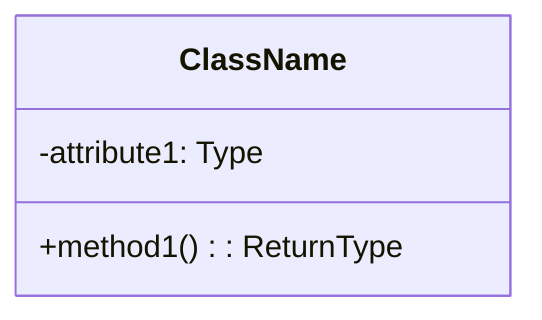
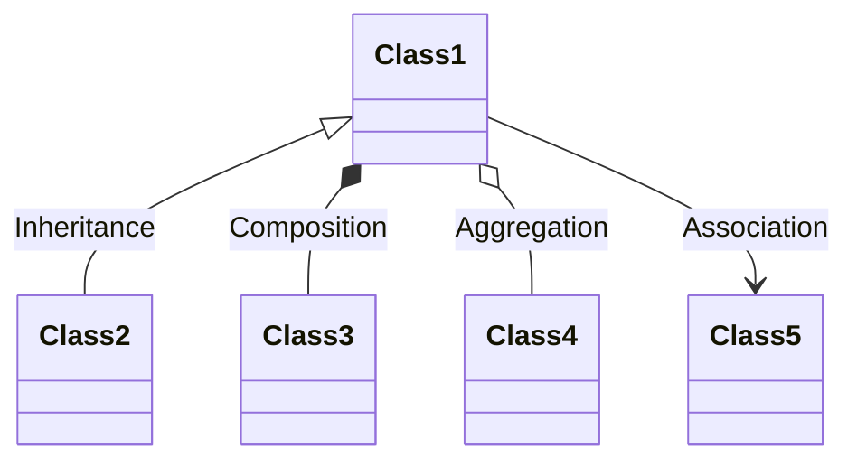
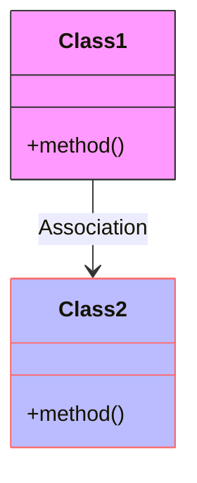

Class diagrams are a cornerstone of object-oriented modeling, offering a static view of the system structure by showing classes, their attributes, operations (methods), and the relationships among classes. Mermaid simplifies the creation of class diagrams through its text-based syntax, enabling developers, architects, and designers to visualize and document software structure efficiently. This guide introduces you to creating class diagrams with Mermaid, covering basic to advanced features to help you effectively model your systems.

## Introduction to Class Diagrams in Mermaid

Mermaid class diagrams allow you to define classes, interfaces, and the relationships between them, such as inheritance, association, and aggregation, using a straightforward, text-based notation. These diagrams are invaluable for planning, discussing, and documenting object-oriented systems.

## Creating a Basic Class Diagram

The foundation of a class diagram in Mermaid involves defining classes and their relationships. Here's a step-by-step approach to get you started:

### 1. Defining Classes

In Mermaid, you define a class with its name, attributes, and methods. Attributes represent the data, while methods represent the operations that can be performed on the data.



The `-` and `+` symbols denote visibility (private and public, respectively).

### 2. Relationships Between Classes

Mermaid supports various types of relationships, including:

- **Association**: A basic relationship between two classes.
- **Aggregation**: Represents a whole/part relationship.
- **Composition**: A stronger form of aggregation indicating ownership.
- **Inheritance**: Shows how a class inherits from another.



These symbols (`<|--`, `*--`, `o--`, `-->`) represent inheritance, composition, aggregation, and association, respectively.

## Enhancing Your Class Diagrams

To model complex systems accurately, you may need to use advanced features of Mermaid class diagrams:

### Interface Implementation

Interfaces can be defined similar to classes but are used to specify a contract that implementing classes must follow:

```mermaid
classDiagram
    interface InterfaceName {
        +method1(): ReturnType
    }
    InterfaceName <|.. ClassName: Implements
```

The `<|..` symbol denotes that `ClassName` implements the interface `InterfaceName`.

### Abstract Classes and Methods

Mermaid allows marking classes or methods as abstract to indicate that they cannot be instantiated directly:

```mermaid
classDiagram
    abstract class AbstractClass {
        +abstractMethod(): void
    }
```

### Grouping Classes into Packages

For large diagrams, organizing classes into packages can improve readability:

```mermaid
classDiagram
    package "PackageName" {
        Class1
        Class2
    }
```

This groups `Class1` and `Class2` into a package named "PackageName."

## Advanced Features

Mermaid class diagrams also support additional functionalities to add clarity and detail:

### Notes

Adding notes can provide extra context or explanations within your diagram:

```mermaid
classDiagram
    Class1 : +int id
    note right of Class1 : This is a note.
```

### Styling

Customizing the appearance of your diagrams can highlight specific elements or align with your branding:



This applies custom fill and stroke styles to `Class1` and `Class2`.

## Conclusion

Mermaid class diagrams offer a powerful and accessible way to model and document the structure of object-oriented systems. By mastering the syntax and advanced features of Mermaid, you can create detailed, informative class diagrams that enhance your project's documentation and design. Whether you're sketching out a new application, communicating design decisions, or documenting an existing system, Mermaid class diagrams provide the tools you need to convey complex structures with clarity and precision.
