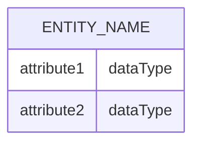
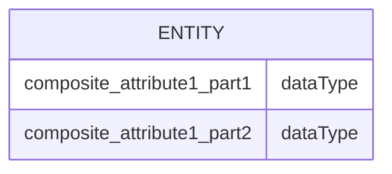

Entity Relationship Diagrams (ERDs) are essential for modeling the data structure of database systems, providing a clear visual representation of entities, their attributes, and the relationships between them. Mermaid's support for ERDs allows developers, database designers, and system analysts to define and visualize the structure of databases through simple text-based syntax. This guide delves into creating ERDs using Mermaid, from basic concepts to advanced features, to efficiently model your data structures.

## Introduction to ERDs in Mermaid

Mermaid ERDs enable the representation of database schemas, highlighting how entities (such as tables) relate to each other and what attributes they contain. These diagrams are pivotal for planning database structures, understanding existing databases, or documenting system designs.

## Creating a Basic ERD

The foundational elements of an ERD in Mermaid include entities, attributes, and the relationships among these entities. Here's a step-by-step guide to get started:

### 1. Defining Entities and Attributes

Entities represent the tables or objects in your database, and attributes are the data points within those entities. In Mermaid, entities and their attributes are defined as follows:



### 2. Defining Relationships

Relationships illustrate how entities interact with each other. Mermaid supports various types of relationships, such as one-to-one, one-to-many, and many-to-many, using different symbols:

- **One-to-One** (`||--||`): Indicates that a record in one entity is related to only one record in another entity.
- **One-to-Many** (`||--o`): Shows that a record in one entity can be associated with multiple records in another entity.
- **Many-to-Many** (`o--o`): Represents that multiple records in one entity can relate to multiple records in another entity.

```mermaid
erDiagram
    ENTITY1 ||--|| ENTITY2 : relationship
    ENTITY1 ||--o ENTITY3 : relationship
    ENTITY3 o--o ENTITY4 : relationship
```

## Enhancing Your ERDs

To accurately model complex database schemas, you might need to use Mermaid's advanced ERD features:

### Primary and Foreign Keys

Highlighting key attributes is crucial for understanding the structure and relationships within a database. Mermaid doesn't have a specific syntax for marking primary or foreign keys, but you can use naming conventions or notes to indicate them:

```mermaid
erDiagram
    ENTITY1 {
        key attribute1 dataType
        attribute2 dataType
    }
```

### Composite Attributes

For entities with composite attributes, you can group related attributes together or use naming conventions to indicate their relationship:



### Cardinality and Participation

While Mermaid's ERD syntax primarily focuses on the types of relationships, the details about cardinality (e.g., exactly one, one or more) and participation (optional or mandatory) are generally conveyed through the relationship lines and can be further clarified in documentation accompanying the ERD.

## Advanced Features

Mermaid's ERD capabilities also include additional features for clarity and detail:

### Notes

Adding notes next to entities or relationships can provide extra context or detail where Mermaid's syntax might be limited:

```mermaid
erDiagram
    ENTITY {
        attribute dataType
    }
    note right of ENTITY : This is a note.
```

### Styling

Customizing the appearance of your ERD can help distinguish between different types of entities or relationships:

```mermaid
erDiagram
    ENTITY1 {
        attribute dataType
    }
    ENTITY2 {
        attribute dataType
    }
    ENTITY1 ||--|| ENTITY2
    style ENTITY1 fill:#f9f,stroke:#333
    style ENTITY2 fill:#bbf,stroke:#f66
```

This applies custom styles to entities, enhancing visual differentiation in your diagram.

## Conclusion

Mermaid ERDs provide a powerful and accessible means to model the structure of databases visually. By mastering both the basic syntax and advanced features of Mermaid, you can create detailed and informative diagrams that clearly communicate the relationships and attributes within your database schema. Whether you're designing a new database, analyzing an existing system, or documenting a complex database structure, Mermaid ERDs offer a streamlined approach to visualizing and understanding data relationships.
