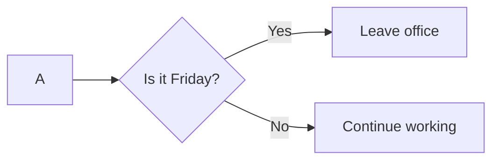
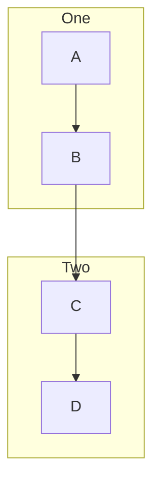
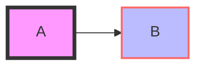

Mermaid flowcharts offer a unique and efficient way to document workflows, processes, and decision trees using simple text-based syntax. This guide is dedicated to helping you understand and create Mermaid flowcharts from the ground up.

## Introduction to Mermaid Flowcharts

Mermaid is a language-like tool that enables the generation of diagrams and flowcharts with text. It's particularly useful in environments where embedding graphical diagrams into text files, like Markdown, is needed. The real power of Mermaid lies in its simplicity and its ability to integrate seamlessly into documentation, making it a favorite among developers and technical writers.

## Basics of Mermaid Flowchart Syntax

The core of Mermaid flowcharts is its syntax, which is designed to be both intuitive and expressive. Here's a quick overview of how to get started:

### 1. Defining a Flowchart

A flowchart in Mermaid starts with the `graph` directive, followed by a direction indicator (e.g., `LR` for left-to-right, `TB` for top-to-bottom). This sets the stage for your flowchart.

```mermaid
graph TB
```

### 2. Creating Nodes

Nodes represent the various states or steps in your flowchart. In Mermaid, you can easily create nodes and label them as follows:

```mermaid
A[Start]
B(Step)
C{Decision}
D>Process]
```

Each shape (square brackets, round brackets, curly braces, and right-angle brackets) represents different types of steps or actions in your flowchart.

### 3. Connecting Nodes

Nodes are connected using arrows (`-->`). You can also label these connections to describe the action or decision being taken:

```mermaid
A --> B --> C
C -->|Yes| D
C -->|No| E
```

This snippet shows a flow from A to B to C, where C is a decision point leading to different outcomes (D or E) based on a condition.

## Enhancing Your Flowcharts

While the basics can get you started, Mermaid's real strength is in the details. Let's dive into some features that can add clarity and impact to your flowcharts.

### Decision Making and Branching

Mermaid makes illustrating decision points straightforward. Use curly braces `{}` to denote decision nodes, and label your branches to guide the reader through your flow:



### Subgraphs for Organization

For complex flowcharts, organizing related processes into subgraphs can enhance readability:



This organizes your flowchart into two distinct sections, `One` and `Two`, with a flow from `A` to `D`.

### Styling for Clarity

Mermaid allows for the customization of nodes and arrows to convey additional meaning or simply to align with your branding:



This applies custom colors and stroke widths to your nodes, making your diagram visually distinctive.

## Advanced Features

Mermaid also supports more complex features like clickable links in nodes, integration with CSS for global styling, and dynamic rendering options for interactive diagrams. These features allow for the creation of not just static diagrams but interactive documentation components.

## Conclusion

Mermaid flowcharts are an excellent tool for visually representing processes, workflows, and decision trees. By learning the basic syntax and exploring advanced features, you can create detailed, informative, and visually appealing diagrams directly in your Markdown files or web documents. Whether you're documenting a software process, outlining a project workflow, or mapping out decision trees, Mermaid offers a flexible and powerful solution to bring clarity and visual impact to your documentation.
