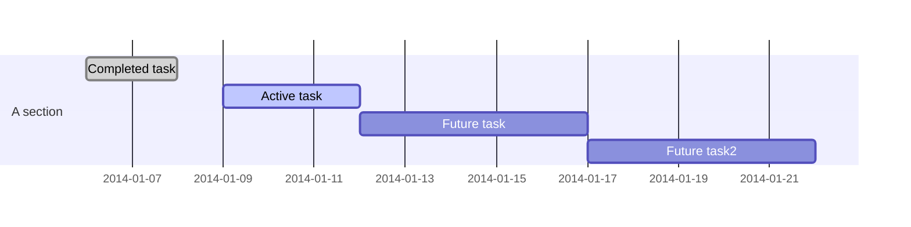
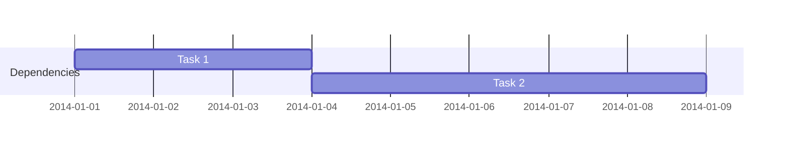
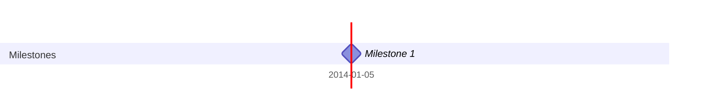

Gantt charts are a popular tool for project management, providing a visual timeline for projects, highlighting tasks, their durations, dependencies, and milestones. Mermaid simplifies the creation of Gantt charts with its text-based syntax, allowing project managers, team leads, and planners to efficiently outline project timelines and track progress. This guide will introduce you to creating Gantt charts using Mermaid, from the basics to more advanced features.

## Introduction to Gantt Charts in Mermaid

Mermaid's Gantt charts enable you to visualize project schedules, illustrating when tasks start and finish, how they overlap, and where dependencies exist between tasks. This visualization helps in planning, coordinating, and tracking the various elements of a project.

## Creating a Basic Gantt Chart

To create a Gantt chart in Mermaid, you start with the `gantt` directive, followed by specifying the date format and the title of the chart. Then, you define sections and tasks within those sections. Here’s how to get started:

### 1. Setting Up Your Gantt Chart

Begin by defining the configuration of your Gantt chart, including the title and date format:

```mermaid
gantt
    title A Gantt Diagram
    dateFormat  YYYY-MM-DD
    section Section
```

The `dateFormat` specifies how you'll enter dates for each task.

### 2. Adding Tasks

Tasks are the core of the Gantt chart, representing the work to be done. You add tasks under sections to organize them logically:



This snippet illustrates tasks with different statuses (`done`, `active`) and durations. The `after` keyword specifies dependencies, indicating that some tasks start after others finish.

## Enhancing Your Gantt Charts

Mermaid Gantt charts support several advanced features to model complex project timelines:

### Dependencies Between Tasks

You can define dependencies to indicate that a task cannot start until another task is completed:



`after a1` creates a dependency, showing that "Task 2" starts after "Task 1" is completed.

### Milestones

Milestones mark significant points in the project timeline and can be added as tasks with a duration of `0d`:



### Excluding Weekends

For projects that don't run on weekends, you can exclude Saturdays and Sundays from the chart:

```mermaid
gantt
    excludes weekends
```

This ensures the chart accurately reflects working days.

## Advanced Features

### Customizing Task Styles

Mermaid allows for some customization of task styles, such as marking tasks as `done` or `active`, but detailed styling options like colors are limited within the Mermaid syntax itself. For more extensive styling, external CSS or post-processing might be necessary.

### Section and Task Descriptions

Adding descriptive labels to sections and tasks improves the readability and information content of your Gantt chart:

```mermaid
gantt
    section Detailed Description
    Detailed task  :detail, d1, 2014-01-02, 3d
```

## Conclusion

Mermaid Gantt charts provide a straightforward and effective way to visualize project timelines, tasks, dependencies, and milestones. By mastering the syntax and exploring advanced features, you can create detailed and informative Gantt charts that enhance your project planning and tracking processes. Whether you're managing a small project or coordinating a complex series of tasks and milestones, Mermaid's Gantt charts offer a valuable tool for visualizing project schedules and ensuring that your projects stay on track.
