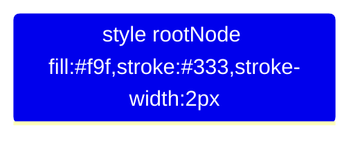

Mindmaps are a visual representation of ideas and concepts, organized around a central theme or problem. They are used for brainstorming, planning, problem-solving, and decision-making, making them a versatile tool in both educational and professional settings. Mermaid introduces a straightforward way to create mindmaps with text, allowing for easy integration into documentation, notes, and web pages. This guide will teach you how to create mindmaps using Mermaid, covering both basic and advanced features.

## Introduction to Mindmaps in Mermaid

Mermaid mindmaps enable you to structure information hierarchically, showing relationships between ideas or tasks. They are particularly useful for visual learners and for presenting complex information in a digestible format.

## Creating a Basic Mindmap

Creating a mindmap in Mermaid starts with defining a root node and then branching out into various related topics and subtopics. Here’s how to begin:

### 1. Defining the Root Node

Every mindmap starts with a central node that represents the main idea or theme:


### 2. Adding Branches

From the root node, you branch out into major topics, which can further branch into subtopics:

```mermaid
mindmap
    rootNode[Central Idea]
    rootNode --> Topic1[Topic 1]
    rootNode --> Topic2[Topic 2]
    
    Topic1 --> Subtopic1[Subtopic A]
    Topic1 --> Subtopic2[Subtopic B]
    
    Topic2 --> Subtopic3[Subtopic C]
    Topic2 --> Subtopic4[Subtopic D]
```

This structure visually represents how different topics and subtopics relate to the central idea.

## Enhancing Your Mindmaps

Mermaid mindmaps can be expanded with additional features to represent complex ideas more effectively:

### Directional Branching

You can specify the direction of branches to organize your mindmap spatially:

```mermaid
mindmap
    direction TB  % Top to Bottom
    rootNode[Central Idea]
    
    % Branching out
    rootNode -->|Left branch| Topic1[Topic 1]
    rootNode -->|Right branch| Topic2[Topic 2]
```

This example uses `direction TB` to layout the mindmap from top to bottom and specifies branches to the left and right.

### Deepening the Hierarchy

Mindmaps can have multiple levels of hierarchy, allowing you to drill down into finer details:

```mermaid
mindmap
    rootNode[Central Idea]
    rootNode --> Topic1[Topic 1]
    
    % Adding more subtopics
    Topic1 --> Subtopic1[Subtopic A]
    Subtopic1 --> Detail1[Detail 1]
    Subtopic1 --> Detail2[Detail 2]
```

### Connecting Nodes

While traditional mindmaps typically have a tree structure, Mermaid allows for cross-linking between nodes to represent non-hierarchical relationships:

```mermaid
mindmap
    rootNode[Central Idea]
    rootNode --> Topic1[Topic 1]
    rootNode --> Topic2[Topic 2]
    
    % Cross-linking nodes
    Topic1 -.-> Topic2
```

The `-.->` syntax creates a dashed line, indicating a softer relationship or a cross-link between topics.

## Advanced Features

### Styling Nodes

While Mermaid's syntax for mindmaps focuses on structure, you can apply some basic styling to enhance readability or emphasize certain parts of your mindmap:



This applies custom fill and stroke styles to the root node, making it stand out.

### Using Emojis or Special Characters

To make your mindmap more engaging, you can include emojis or special characters within node labels:

```mermaid
mindmap
    rootNode[🌟 Central Idea]
    rootNode --> Topic1[💡 Topic 1]
```

Including emojis can add visual interest and help convey ideas more effectively.

## Conclusion

Mermaid mindmaps offer a simple yet powerful way to organize and visualize ideas, concepts, and tasks. By mastering the basic structure and exploring advanced features, you can create detailed and visually appealing mindmaps that enhance your brainstorming sessions, project planning, and information organization. Whether for personal use, education, or professional projects, Mermaid mindmaps provide a versatile tool for bringing clarity and insight to complex ideas.
