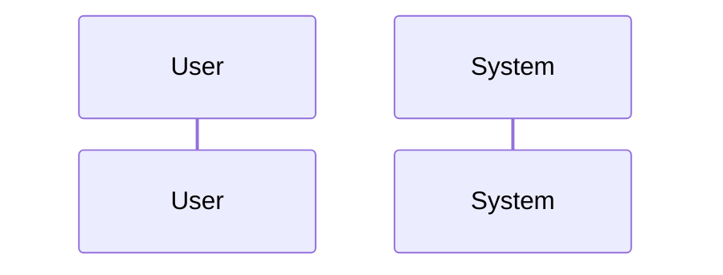
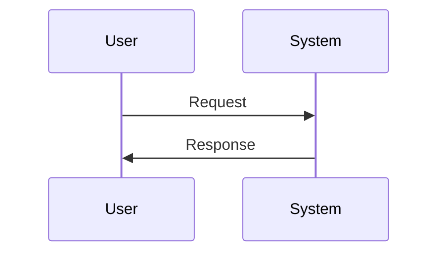
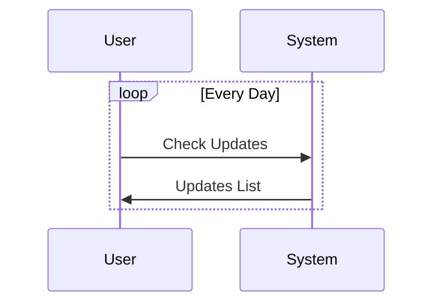
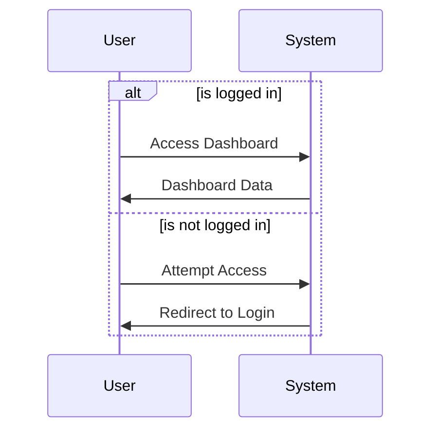
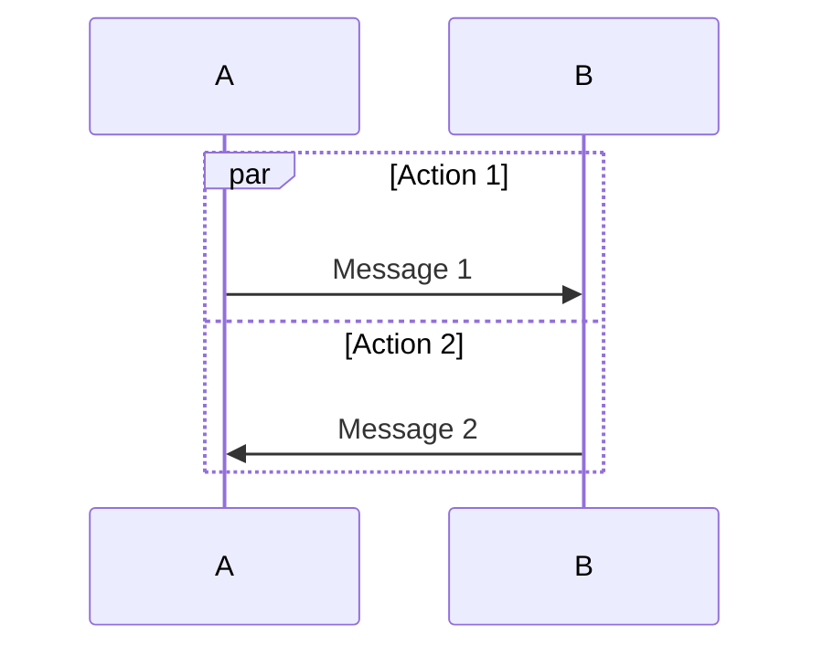
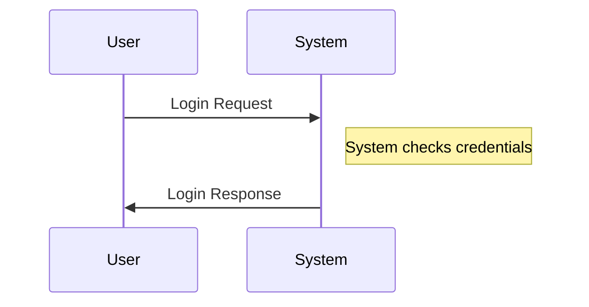

Mermaid sequence diagrams are a powerful tool for visualizing interactions between actors in a system. They help in understanding the flow of messages, events, or actions from one actor to another, making them essential for documenting complex systems, especially in software development and system design. This guide will walk you through the basics of creating sequence diagrams with Mermaid, along with advanced features to enhance your diagrams.

## Introduction to Sequence Diagrams in Mermaid

Sequence diagrams in Mermaid allow you to represent the sequence of messages or interactions in a time-ordered flow between parts of a system. Unlike flowcharts that depict workflows or processes, sequence diagrams focus on the exchange of messages over time, making them ideal for illustrating scenarios in software behavior, protocol design, and service interactions.

## Creating a Basic Sequence Diagram

The foundation of a sequence diagram in Mermaid involves defining participants (actors or objects) and the messages exchanged between them. Here’s how to get started:

### 1. Defining Participants

Participants in a sequence diagram can represent system components, users, or any entity that interacts in the scenario being modeled. Define participants using the `participant` keyword:



### 2. Messaging Between Participants

Messages are the core of sequence diagrams, representing communication or interaction between participants. In Mermaid, you use arrows to denote message flow:



The `->>` syntax represents a message from one participant to another. The text after the colon (`:`) is the message label.

## Enhancing Your Sequence Diagrams

To capture the complexity and nuances of real-world interactions, Mermaid offers features that let you refine and add detail to your sequence diagrams.

### Loops and Conditions

You can depict loops and conditional flows within your sequence diagrams to model repetitive or conditional interactions:



This illustrates a daily check for updates between the User and the System.

### Alternative Paths

Handling alternative scenarios or branching logic is straightforward with Mermaid’s `alt` and `else` keywords:



This diagram shows different interactions based on whether the user is logged in.

### Parallel Messages

For scenarios where actions occur simultaneously, Mermaid supports parallel message flows:



This feature is useful for modeling concurrent processes or interactions.

## Advanced Features

Mermaid sequence diagrams also support advanced functionalities like message customization, notes, and more to add clarity and detail:

### Notes

You can annotate your diagrams with notes to provide additional context or explanations:



### Styling

Mermaid allows you to style your diagrams with CSS-like syntax to match your branding or to highlight specific parts of your diagram:

```mermaid
sequenceDiagram
    participant User
    participant System
    User->>System: Request
    System->>User: Response
    style User fill:#f9f,stroke:#333
    style System fill:#bbf,stroke:#f66
```

This customizes the appearance of your participants and can be extended to messages and notes.

## Conclusion

Mermaid sequence diagrams are a versatile tool for documenting and visualizing the interactions between components in a system. By combining basic constructs with Mermaid’s advanced features, you can create detailed, informative diagrams that enhance understanding of system behaviors and interactions. Whether you’re a software developer, system architect, or technical writer, mastering Mermaid sequence diagrams can significantly improve your documentation and design processes, making complex interactions clear and manageable.
