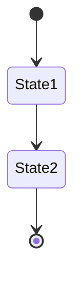
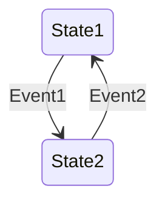
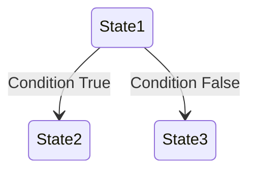
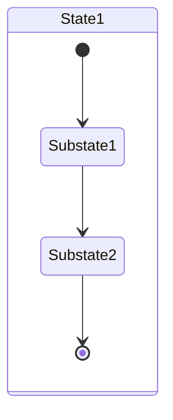
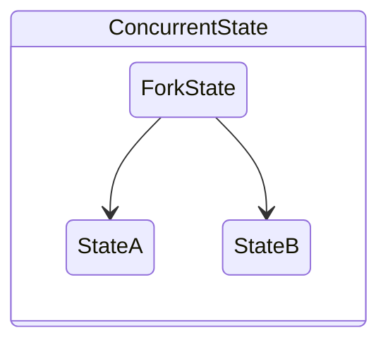
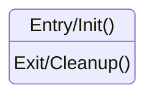
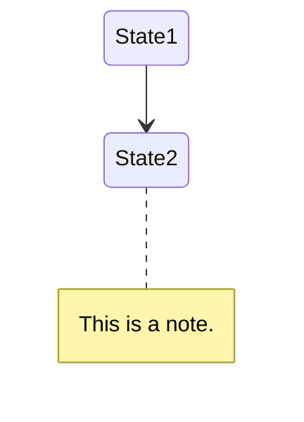
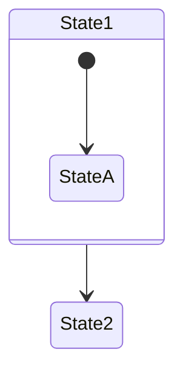

State diagrams, also known as state machine diagrams, are a staple in modeling the behavior of systems. They depict how an object or interaction progresses from one state to another, depending on internal or external events. Mermaid simplifies the creation of state diagrams with its text-based syntax, enabling developers, system designers, and analysts to visualize state transitions and system behaviors efficiently. This guide will walk you through the process of creating state diagrams using Mermaid, from basic concepts to more advanced features.

## Introduction to State Diagrams in Mermaid

Mermaid state diagrams allow you to represent states, transitions, and events within a system. These diagrams are particularly useful for describing the lifecycle of an object, the stages in a process, or the behavior of a system in response to events.

## Creating a Basic State Diagram

The core elements of a state diagram in Mermaid include states, transitions, and events that trigger those transitions. Here's how to get started:

### 1. Defining States

States represent the conditions or situations of an object or system. In Mermaid, states are defined simply by naming them:

Here, `[*]` represents the start and end points of the state machine. `State1` and `State2` are the states the system can be in.

### 2. Transitions Between States

Transitions show how the system moves from one state to another, usually in response to an event:

In this example, `Event1` triggers the transition from `State1` to `State2`, and `Event2` does the opposite.

## Enhancing Your State Diagrams

To accurately model complex behaviors, you may need to utilize Mermaid's advanced state diagram features:

### Conditional Transitions

You can model decision-based transitions using conditional branches:

This depicts a system moving from `State1` to either `State2` or `State3` based on a condition.

### Substates

For systems with complex states, Mermaid supports the definition of substates:

`Substate1` and `Substate2` are nested within `State1`, indicating more detailed state behavior.

### Concurrent States

Systems with parallel processes can be represented using concurrent states:

This shows that from `ForkState`, the system can enter both `StateA` and `StateB` simultaneously.

## Advanced Features

Mermaid state diagrams offer additional features to add clarity and detail:

### Entry and Exit Actions

You can specify actions that occur upon entering or exiting states:

This annotates `State1` with actions to be taken when entering (`Init()`) and exiting (`Cleanup()`) the state.

### Notes

Adding notes can provide extra context or explanations within your diagram:

### Styling

Customizing the appearance of your diagrams can highlight specific elements or align with your documentation style:

This applies custom styles to `State1`, enhancing visual differentiation.

## Conclusion

Mermaid state diagrams are an invaluable tool for documenting and visualizing the behavior of systems through their states and transitions. By leveraging the capabilities of Mermaid, from basic syntax to advanced features, you can create detailed and informative diagrams that clearly communicate the dynamic aspects of your system. Whether you're modeling software behavior, business processes, or complex workflows, mastering Mermaid state diagrams can significantly improve your ability to design, document, and communicate system behaviors.
